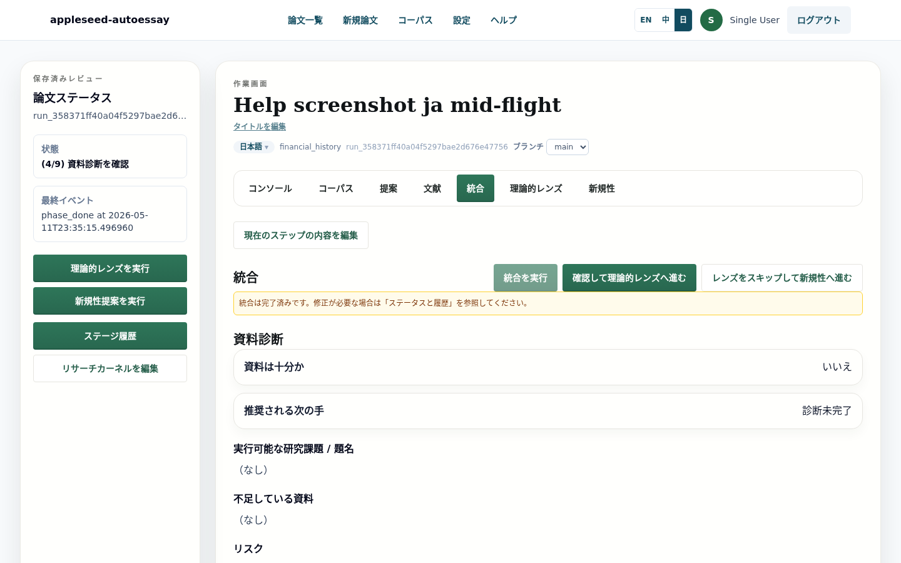
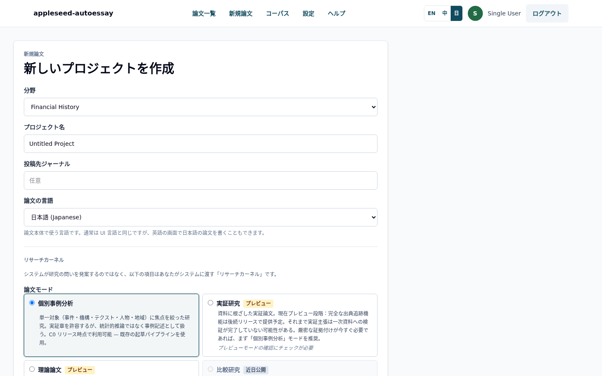
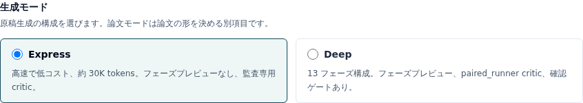
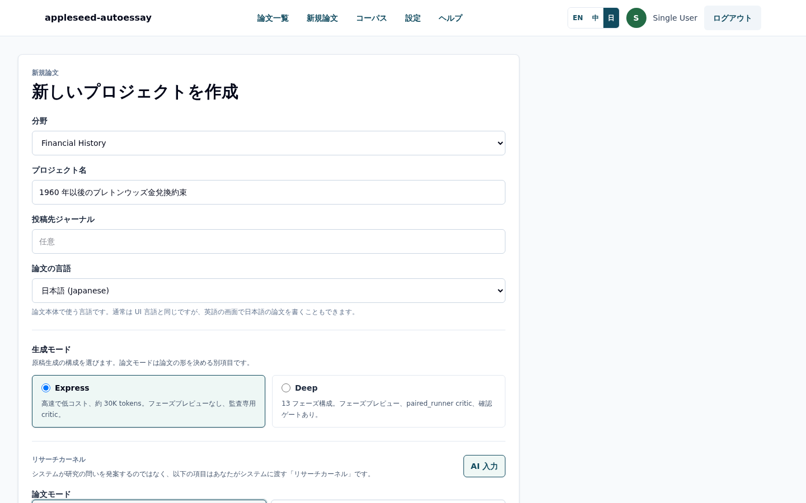
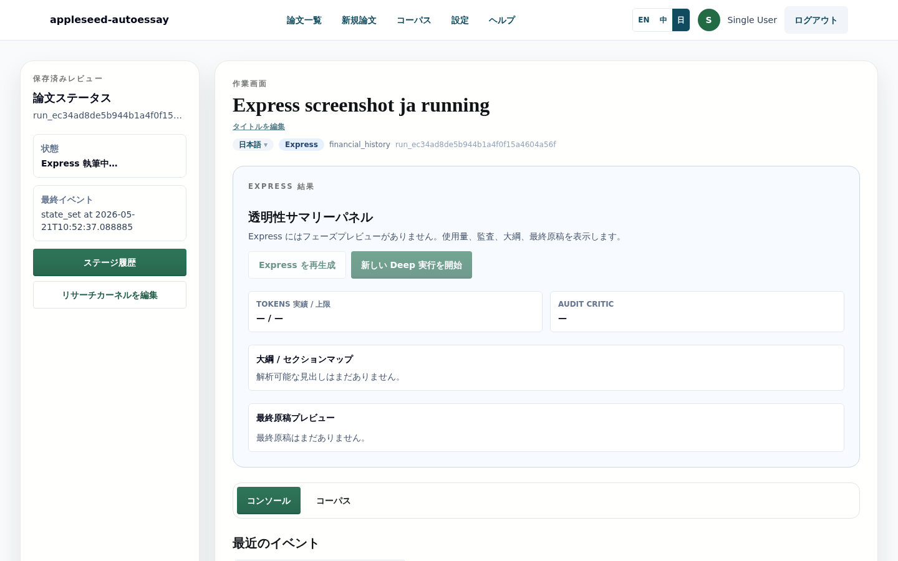
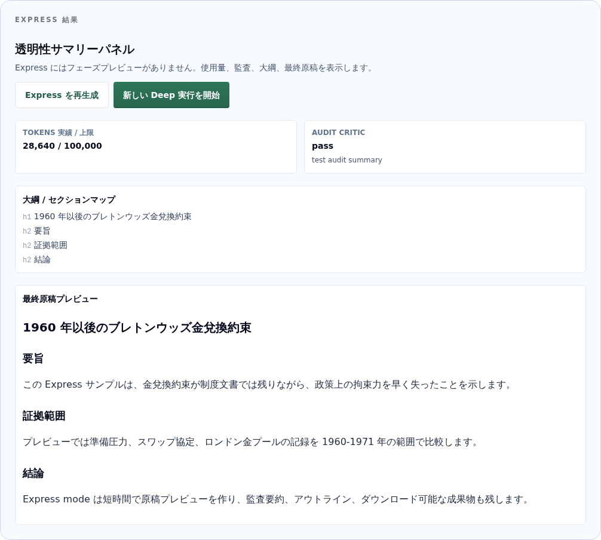
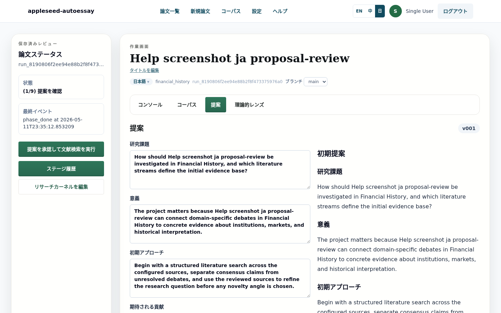
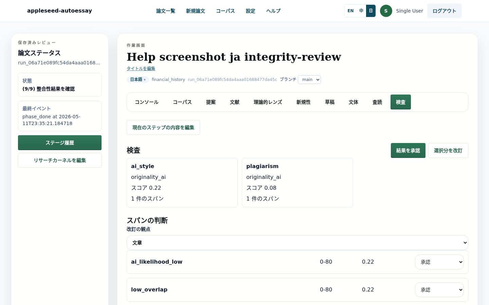
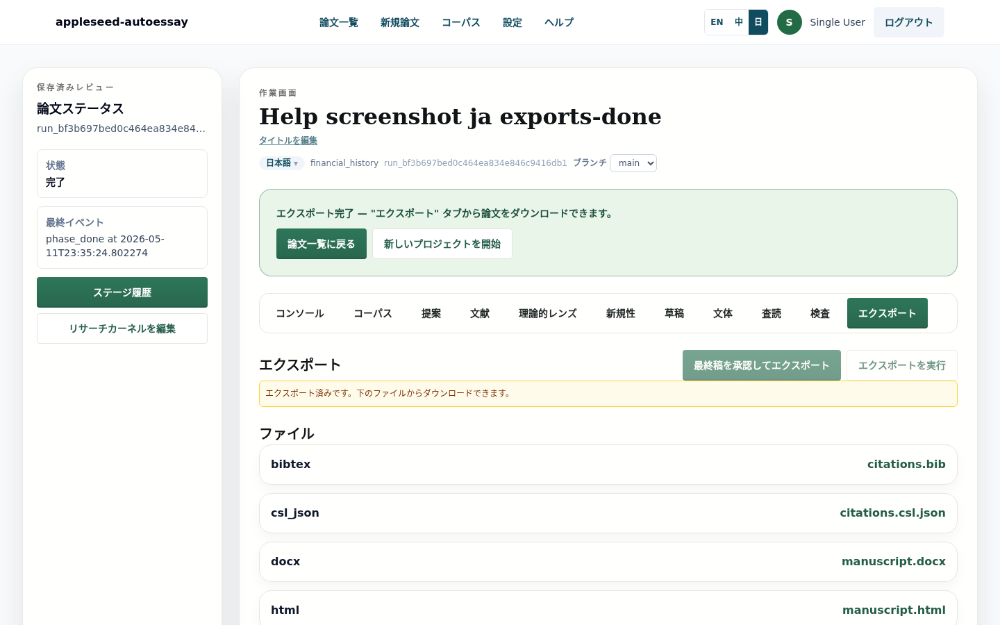

# Appleseed AutoEssay

**言語:** [English](README.md) | [中文](README.zh.md) | 日本語



## 何ができるか

Appleseed AutoEssay は、学術原稿作成のためのオープンソースのワークフローツールです。研究質問を、資料選択、research kernel、状態機械のチェックポイント、監査メモ、出力ファイルを持つ確認可能な原稿へ進めます。アプリには、短時間で下書きを作る Express mode と、資料、統合、下書き、レビュー、整合性確認、エクスポートを確認しながら進める 13-phase Deep mode があります。ローカル実行またはセルフホストを前提にしており、LLM ゲートウェイ、データベース、Redis、アカウント作成フローは運用者が用意します。

このリポジトリには公開ホストサービスは付属しておらず、デフォルトの本番アカウントもありません。

## 主な機能

- **2 つの生成モード:** ARS Express は単一パスの高速原稿作成向け、13-phase Deep は明示的な確認ゲートと段階成果物を持つワークフロー向けです。
- **Research kernel の自動入力:** 題名と分野から、必須の kernel フィールドを AI が下書きし、利用者が編集して確定できます。
- **状態機械ワークフロー:** 各 run は現在状態、最近のイベント、フェーズ履歴、確認ゲート、復旧状態を記録します。
- **多言語 UI:** 英語、中国語、日本語の画面表示に対応し、原稿言語は run ごとに選択します。
- **複数形式の出力:** Markdown、HTML、DOCX、LaTeX、BibTeX、CSL JSON、manifest、文献利用表、self-check report。

## スクリーンショット

### 1. 論文を作成する

`/runs/new` から run を開始し、分野、題名、原稿言語、生成モード、論文モード、research kernel を入力します。



### 2. 生成モードを選ぶ

Express mode は高速な下書き用のデフォルトです。Deep mode は 13 段階のワークフロー、確認点、より豊富なフェーズ成果物が必要な場合に使います。



### 3. AI で Kernel を入力する

Kernel は、執筆前に Appleseed が参照する小さな研究契約です。観察された問題、仮の問い、範囲、方法の希望、理論の希望、一次資料の状態を含みます。AI 入力ボタンは題名と分野から構造化された下書きを作るため、利用者は空欄からではなく編集から始められます。



### 4. Express Mode

Express mode は、設定済みの LLM ゲートウェイ上でおよそ 3-5 分の原稿作成を目指すモードです。実行中はワークスペースが明示的な `EXPRESS_RUNNING` 状態になります。完了後は transparency panel に、トークン使用量、監査状態、アウトライン、原稿プレビューが表示されます。





### 5. Deep Mode: 13 フェーズ

Deep mode は長い状態機械に沿って進みます。proposal、scout、curator、synthesizer、framework lens、ideator、drafter、stylist、final rewrite、critic、integrity、final acceptance、export の流れです。ワークスペースでは、現在状態、フェーズ履歴、確認操作が見えるようになっています。


Proposal 画面では、本格的な資料処理と下書きに入る前に方向性を確認できます。



Integrity フェーズでは、最終承認の前に引用と監査の結果を確認できます。



Export フェーズでは、原稿と補助ファイルをまとめてダウンロードできます。



### 6. 多言語対応

同じ流れのスクリーンショットを `docs/screenshots/**/{en,zh,ja}/` に保存しています。UI 言語スイッチャーは画面文言を切り替え、原稿言語は run ごとの設定として保持されます。

## はじめに

```bash
python3 -m venv backend/.venv
source backend/.venv/bin/activate
python -m pip install -e "backend[dev]"

( cd frontend && npm ci )
cp .env.example .env
DATABASE_URL=sqlite:///./autoessay.sqlite3 alembic -c backend/alembic.ini upgrade head
```

ローカルチェックを実行します。

```bash
backend/scripts/ci-local.sh
```

バックエンドとフロントエンドを別々の shell で起動します。

```bash
source backend/.venv/bin/activate
uvicorn autoessay.main:app --app-dir backend/src --reload --host 127.0.0.1 --port 8017
```

```bash
cd frontend
npm run dev
```

その後、<http://127.0.0.1:3000> を開きます。

## 設定

[.env.example](.env.example) から始めます。サンプルファイルはローカルアドレスとプレースホルダー値だけを使っています。stub ではないワークフローを動かす前に、OpenAI-compatible LLM ゲートウェイ、Redis、データベース、必要に応じて originality-check provider を用意してください。

ローカル開発と CI では、外部 LLM やベンダー呼び出しに stub flags を使えます。本番デプロイでは、アカウント作成フローと secrets をデプロイ基盤から供給し、コミット済みファイルに書かないでください。

最初のパスワードユーザーを作る場合は、bcrypt hash をローカルで生成し、非公開環境に `AUTOESSAY_INITIAL_ADMIN_USERNAME` と `AUTOESSAY_INITIAL_ADMIN_PASSWORD_HASH` を設定します。hash が未設定の場合、このブートストラップ経路は無効です。

## アーキテクチャ

2 モード設計は [ADR-0003: Dual-mode manuscript generation](docs/adr/0003-dual-mode-manuscript-generation.md) に記録されています。Express mode は短時間の下書きとコンパクトな透明性パネルを優先します。Deep mode は、資料確認、統合、下書き、監査、出力のために完全な状態機械ワークフローを保持します。より広い執筆方法は [Methodology reference](references/methodology.md) を参照してください。

## ドキュメント

- [Requirements](docs/REQUIREMENTS.md)
- [Design notes](docs/DESIGN.md)
- [System explanation](docs/explained/SYSTEM_EXPLAINED.en.md)
- [Methodology reference](references/methodology.md)
- [ADR-0003: Dual-mode manuscript generation](docs/adr/0003-dual-mode-manuscript-generation.md)
- [Changelog](CHANGELOG.md)

## セキュリティ

脆弱性を報告する前、またはデプロイを運用する前に [SECURITY.md](SECURITY.md) を読んでください。実際の provider token、アカウント認証情報、本番 URL、非公開環境ファイルをコミットしないでください。

## コントリビュート

issue と pull request での貢献を歓迎します。まず [CONTRIBUTING.md](CONTRIBUTING.md) を読み、提出前にローカルチェックを実行し、スクリーンショットやドキュメントに非公開サービス情報が含まれないようにしてください。

## ライセンス

MIT。詳しくは [LICENSE](LICENSE) をご覧ください。
