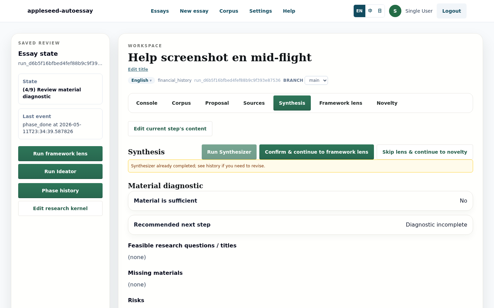
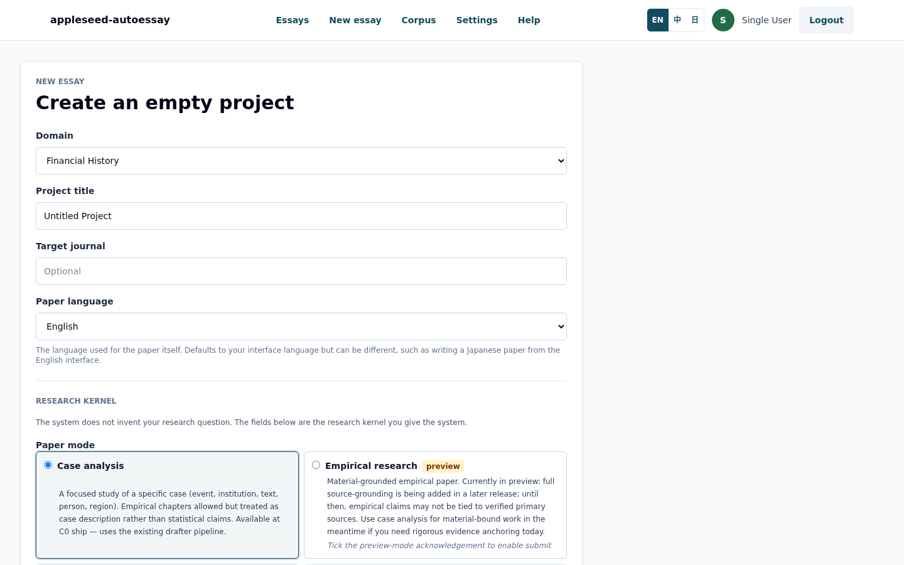
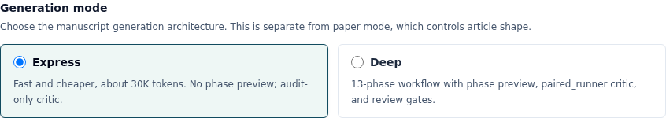
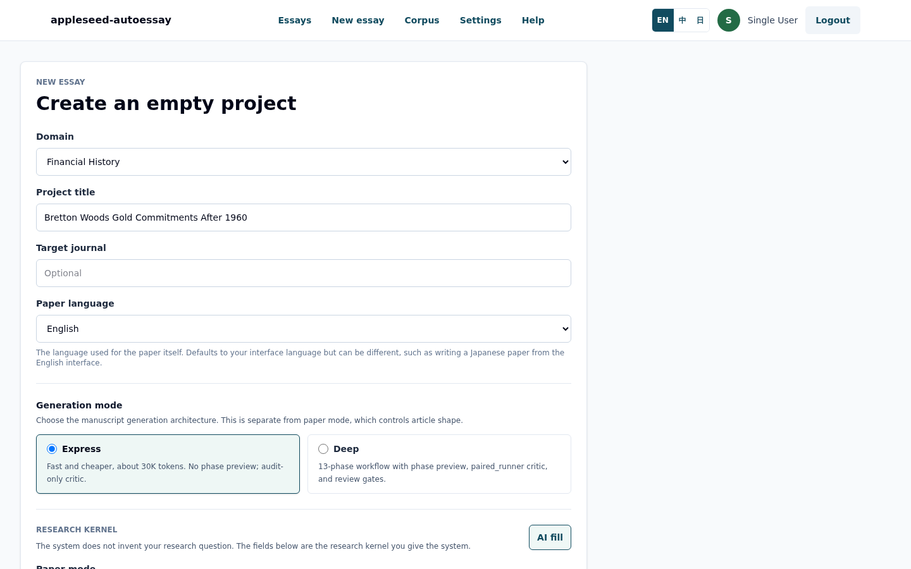
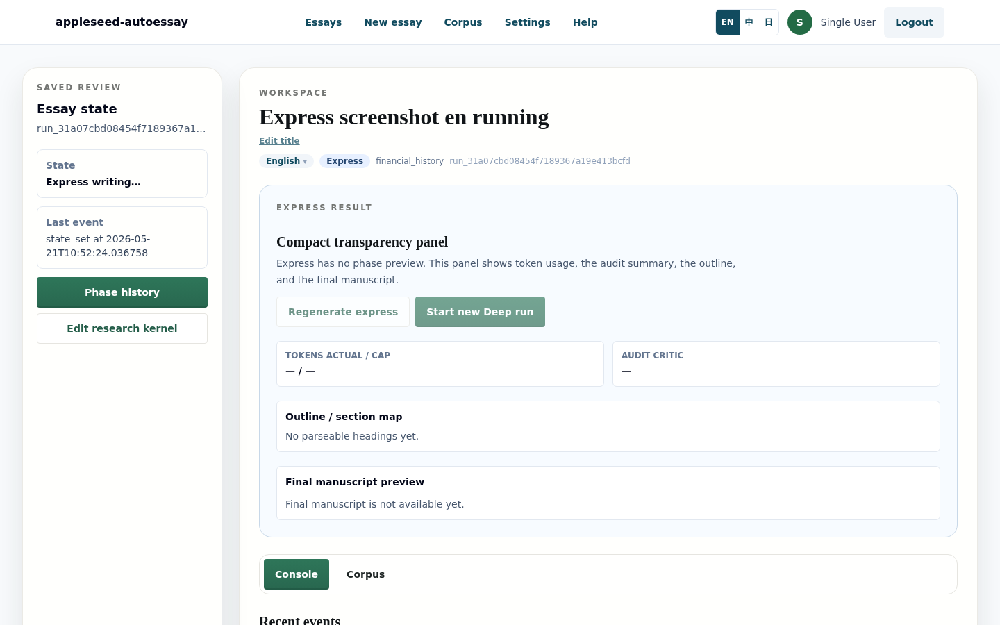
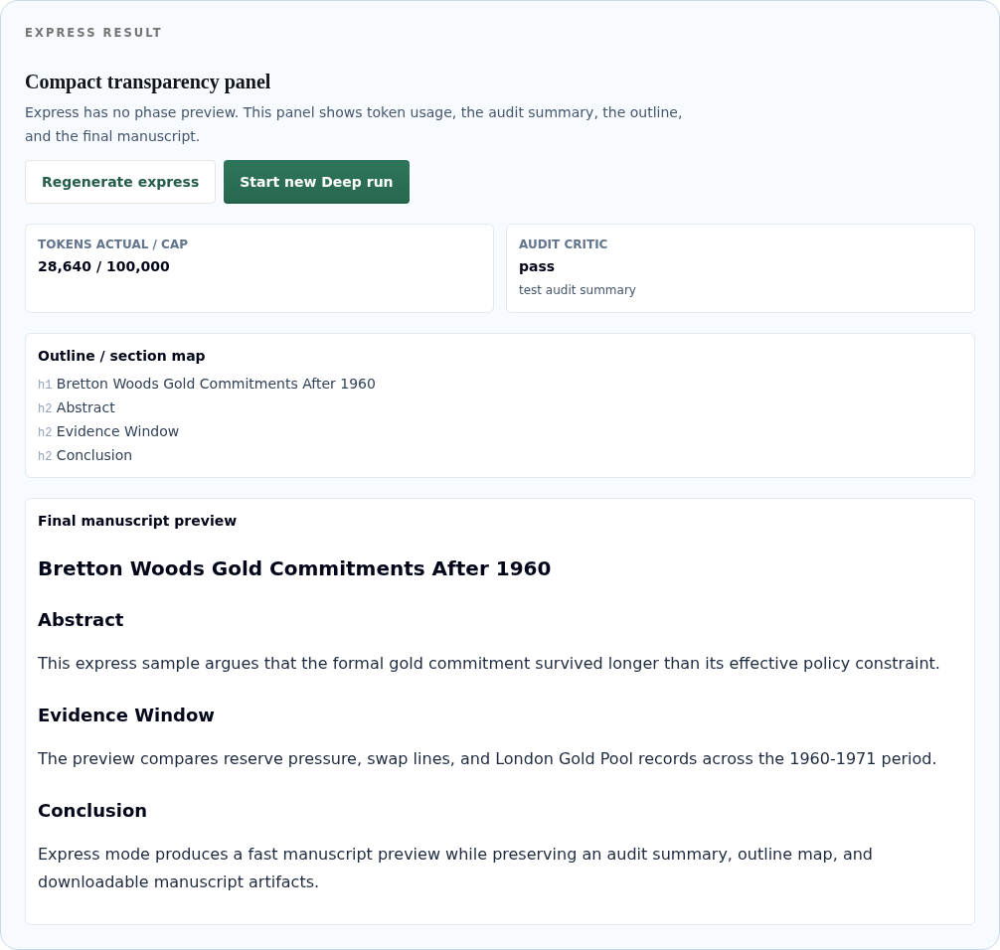
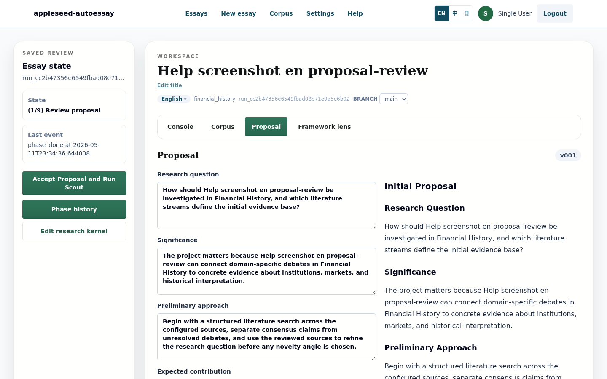
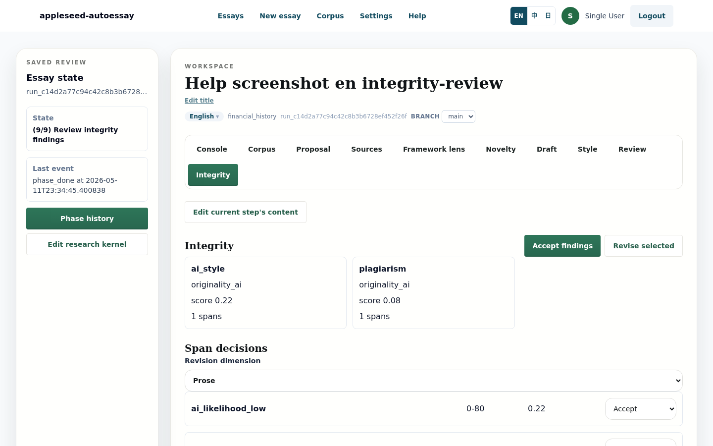
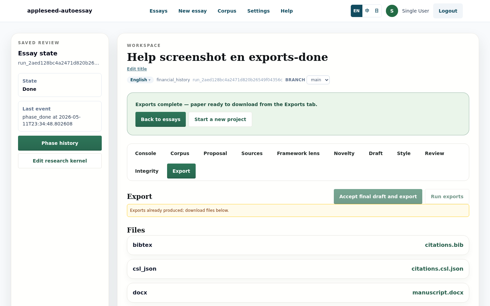

# Appleseed AutoEssay

**Languages:** English | [中文](README.zh.md) | [日本語](README.ja.md)

<p align="center">
  
</p>

## What It Does

Appleseed AutoEssay is an open-source academic manuscript workflow tool. It turns a research question into a reviewable manuscript with source selection, research-kernel capture, state-machine checkpoints, audit notes, and export files. The app supports a fast Express path for quick drafts and a 13-phase Deep path for reviewable source, synthesis, drafting, review, integrity, and export work. It is built for local or self-hosted deployments where operators provide their own LLM gateway, database, Redis, and account flow.

There is no hosted public service attached to this repository and there are no default production accounts.

## Key Features

- **Dual-mode generation:** choose ARS Express for a faster single-pass manuscript path, or 13-phase Deep mode for a reviewable workflow with explicit gates.
- **Research-kernel autogeneration:** start from a title and domain, then let the AI fill the required kernel fields before you edit and submit them.
- **State-machine workflow:** each run records its current state, recent events, phase history, review gates, and recovery state.
- **Multi-language UI:** English, Chinese, and Japanese UI copy, with manuscript language selected per run.
- **Export formats:** Markdown, HTML, DOCX, LaTeX, BibTeX, CSL JSON, manifest, literature-usage table, and self-check report.

## Screenshots Walkthrough

### 1. Create An Essay

Start a run from `/runs/new` by choosing a domain, title, manuscript language, generation mode, paper mode, and research-kernel fields.

<p align="center">
  
</p>

### 2. Choose A Generation Mode

Express mode is the default for quick drafts. Deep mode is available when you want the longer 13-phase workflow with review points and richer phase artifacts.

<p align="center">
  
</p>

### 3. Let AI Fill The Kernel

The kernel is the compact research contract Appleseed uses before writing: observed puzzle, tentative question, scope, method preference, theory preference, and primary-material status. The AI fill button drafts these fields from the title and domain so the user edits a structured starting point instead of a blank form.

<p align="center">
  
</p>

### 4. Express Mode

Express mode is designed for a roughly 3-5 minute manuscript pass on a configured LLM gateway. While it runs, the workspace stays in an explicit `EXPRESS_RUNNING` state; when it finishes, the transparency panel shows token usage, audit status, an outline map, and a manuscript preview.

<p align="center">
  
</p>

<p align="center">
  
</p>

### 5. Deep Mode: 13-Phase Workflow

Deep mode walks through the longer state machine: proposal, scout, curator, synthesizer, framework lens, ideator, drafter, stylist, final rewrite, critic, integrity, final acceptance, and export. The workspace keeps the active state, phase history, and review controls visible.

<p align="center">
  
</p>

The proposal screen gives the user an early direction check before deeper source and drafting work starts.

<p align="center">
  
</p>

The integrity stage surfaces citation and audit findings before final acceptance.

<p align="center">
  
</p>

The export stage packages the manuscript and supporting files for downstream review.

<p align="center">
  
</p>

### 6. Multi-Language UI

The same workflow is captured in English, Chinese, and Japanese under `docs/screenshots/**/{en,zh,ja}/`. The UI language switcher changes product copy, while manuscript language remains a per-run setting.

## Quick Start

```bash
python3 -m venv backend/.venv
source backend/.venv/bin/activate
python -m pip install -e "backend[dev]"

( cd frontend && npm ci )
cp .env.example .env
DATABASE_URL=sqlite:///./autoessay.sqlite3 alembic -c backend/alembic.ini upgrade head
```

Run the local checks:

```bash
backend/scripts/ci-local.sh
```

Run the backend and frontend in separate shells:

```bash
source backend/.venv/bin/activate
uvicorn autoessay.main:app --app-dir backend/src --reload --host 127.0.0.1 --port 8017
```

```bash
cd frontend
npm run dev
```

Then open <http://127.0.0.1:3000>.

## Configuration

Start from [.env.example](.env.example). The example file uses local addresses and placeholder values only. Provide your own OpenAI-compatible LLM gateway, Redis, database, and optional originality-check providers before running non-stubbed workflows.

For local development and CI, use stub flags for external LLM and vendor calls. Production deployments should supply their own account creation flow and secrets through the deployment platform, not through committed files.

To bootstrap the first password user, generate a bcrypt hash locally and set `AUTOESSAY_INITIAL_ADMIN_USERNAME` plus `AUTOESSAY_INITIAL_ADMIN_PASSWORD_HASH` in your private environment. The bootstrap path is disabled when the hash is unset.

## Architecture

The dual-mode design is recorded in [ADR-0003: Dual-mode manuscript generation](docs/adr/0003-dual-mode-manuscript-generation.md). Express mode optimizes for quick draft turnaround and a compact transparency panel; Deep mode keeps the full state-machine workflow for source review, synthesis, drafting, audits, and exports. The broader writing method is described in [Methodology reference](references/methodology.md).

## Documentation

- [Requirements](docs/REQUIREMENTS.md)
- [Design notes](docs/DESIGN.md)
- [System explanation](docs/explained/SYSTEM_EXPLAINED.en.md)
- [Methodology reference](references/methodology.md)
- [ADR-0003: Dual-mode manuscript generation](docs/adr/0003-dual-mode-manuscript-generation.md)
- [Changelog](CHANGELOG.md)

## Security

Read [SECURITY.md](SECURITY.md) before reporting vulnerabilities or operating a deployment. Do not commit real provider tokens, account credentials, production URLs, or private environment files.

## Contributing

Contributions are welcome through issues and pull requests. Start with [CONTRIBUTING.md](CONTRIBUTING.md), run the local checks before submitting changes, and keep screenshots or docs free of private service details.

## License

MIT. See [LICENSE](LICENSE).
