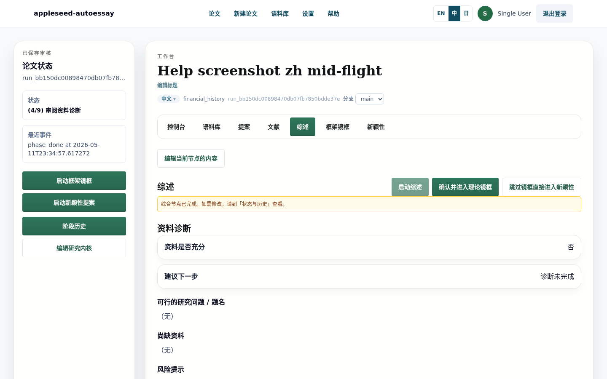
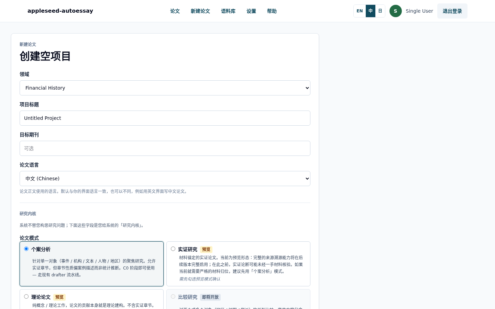
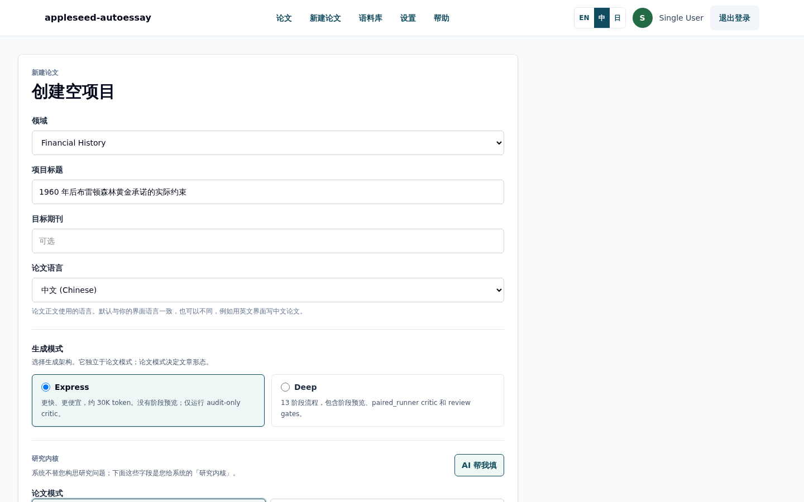
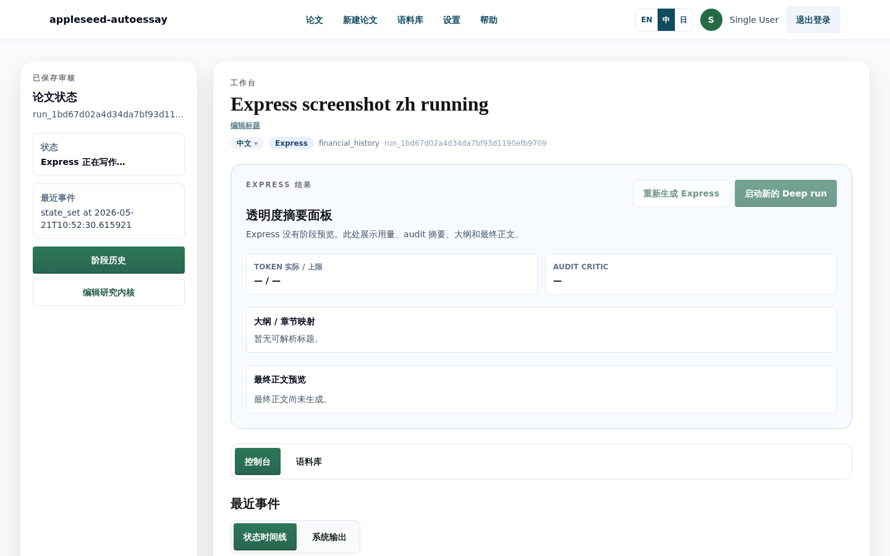
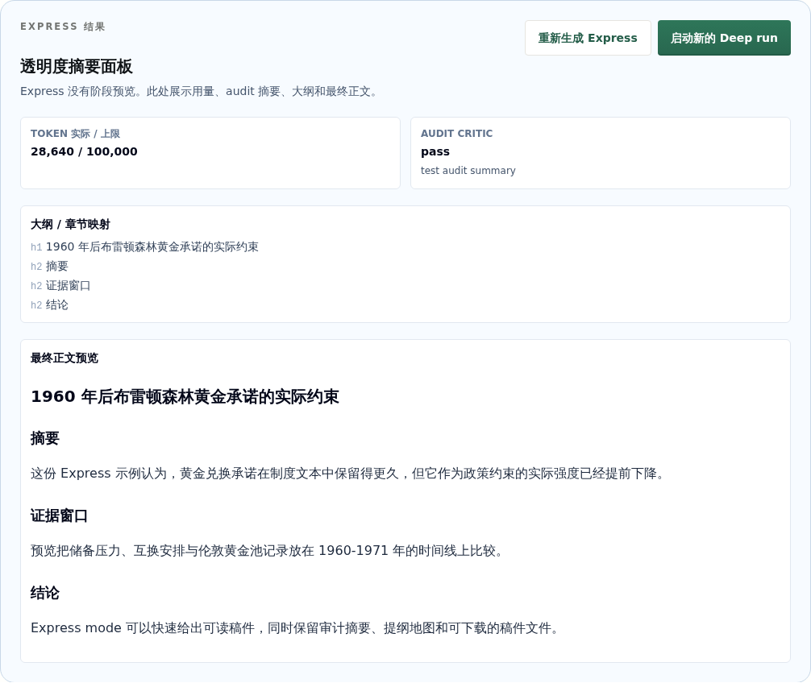
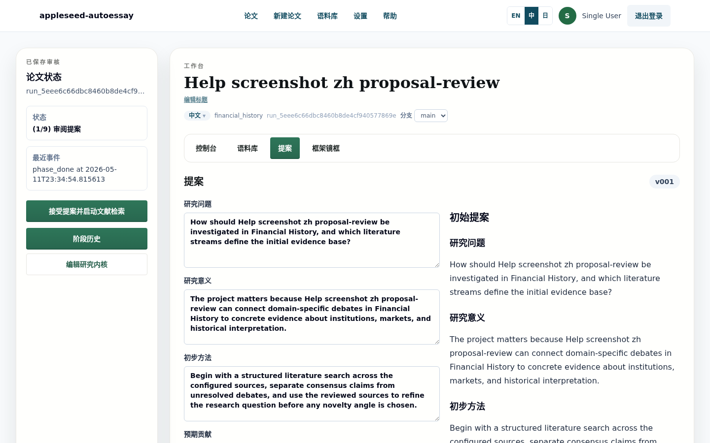
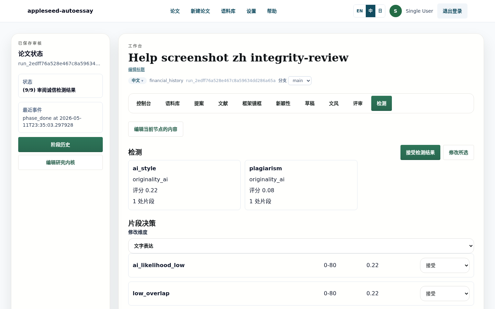
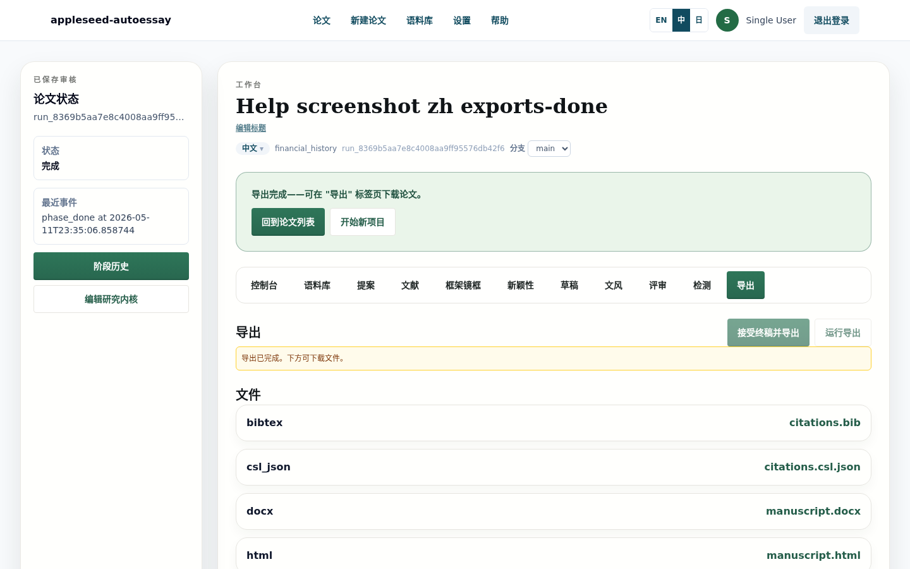

# Appleseed AutoEssay

**语言：** [English](README.md) | 中文 | [日本語](README.ja.md)

<p align="center">
  
</p>

## 它能做什么

Appleseed AutoEssay 是一个开源的学术论文生成工作流工具。它把研究问题推进为可审阅的论文稿件，并保留文献选择、研究 kernel、状态机检查点、审计记录和导出文件。应用提供两条生成路径：Express mode 用于快速出稿，13-phase Deep mode 用于可逐步审查的文献、综合、起草、评审、诚信检查和导出流程。它面向本地运行或自托管部署，LLM 网关、数据库、Redis 和账号体系都由部署方自行提供。

本仓库没有绑定公开托管服务，也没有默认生产账号。

## 核心功能

- **双模式生成：** ARS Express 适合快速获得单次成稿；13-phase Deep 适合需要明确审阅点和阶段产物的完整流程。
- **Research kernel 自动生成：** 输入题目和领域后，可让 AI 先填好必需的 kernel 字段，再由用户编辑确认。
- **状态机工作流：** 每次运行都会记录当前状态、最近事件、阶段历史、审阅门槛和恢复状态。
- **三语界面：** 界面支持英文、中文、日文；论文语言在每次运行中单独选择。
- **多格式导出：** Markdown、HTML、DOCX、LaTeX、BibTeX、CSL JSON、manifest、文献使用表和 self-check report。

## 截图流程

### 1. 创建论文

在 `/runs/new` 创建运行：选择研究领域、题目、论文语言、生成模式、论文模式，并填写研究 kernel。

<p align="center">
  
</p>

### 2. 选择生成模式

Express mode 是默认选项，适合先得到快速草稿。Deep mode 适合需要 13 个阶段、审阅点和更丰富阶段产物的写作流程。

<p align="center">
  
</p>

### 3. AI 帮我填 Kernel

Kernel 是 Appleseed 写作前使用的精简研究契约，包含观察到的研究张力、临时问题、范围、方法偏好、理论偏好和一手材料状态。AI 帮我填会根据题目和领域生成结构化初稿，用户再编辑，而不是从空白表单开始。

<p align="center">
  
</p>

### 4. Express Mode

Express mode 面向配置好 LLM 网关后的约 3-5 分钟快速出稿。运行时工作台保持明确的 `EXPRESS_RUNNING` 状态；完成后，transparency panel 会显示 token 使用量、审计状态、提纲地图和稿件预览。

<p align="center">
  
</p>

<p align="center">
  
</p>

### 5. Deep Mode：13 阶段流程

Deep mode 会沿着更长的状态机推进：proposal、scout、curator、synthesizer、framework lens、ideator、drafter、stylist、final rewrite、critic、integrity、final acceptance 和 export。工作台会持续显示当前状态、阶段历史和审阅控制。

<p align="center">
  
</p>

Proposal 页面让用户在进入更重的文献与起草流程前先检查方向。

<p align="center">
  
</p>

Integrity 阶段会在最终接受前展示引用和审计发现。

<p align="center">
  
</p>

Export 阶段会打包正文和配套文件，方便后续审阅与下载。

<p align="center">
  
</p>

### 6. 多语言支持

同一套流程截图已按英文、中文、日文保存到 `docs/screenshots/**/{en,zh,ja}/`。界面语言切换会改变产品文案；论文语言仍是每次运行自己的设置。

## 快速开始

```bash
python3 -m venv backend/.venv
source backend/.venv/bin/activate
python -m pip install -e "backend[dev]"

( cd frontend && npm ci )
cp .env.example .env
DATABASE_URL=sqlite:///./autoessay.sqlite3 alembic -c backend/alembic.ini upgrade head
```

运行本地检查：

```bash
backend/scripts/ci-local.sh
```

分别在两个 shell 中启动后端和前端：

```bash
source backend/.venv/bin/activate
uvicorn autoessay.main:app --app-dir backend/src --reload --host 127.0.0.1 --port 8017
```

```bash
cd frontend
npm run dev
```

然后打开 <http://127.0.0.1:3000>。

## 配置

从 [.env.example](.env.example) 开始。示例文件只使用本地地址和占位值。运行非 stub 工作流前，请自行提供 OpenAI-compatible LLM 网关、Redis、数据库和可选的原创性检查服务。

本地开发和 CI 可使用 stub flags 跳过外部 LLM 与供应商调用。生产部署应通过部署平台提供账号创建流程和 secrets，不要把它们写进仓库。

如需引导第一个密码用户，请在本地生成 bcrypt hash，并在私有环境中设置 `AUTOESSAY_INITIAL_ADMIN_USERNAME` 与 `AUTOESSAY_INITIAL_ADMIN_PASSWORD_HASH`。未设置 hash 时，引导路径不会启用。

## 架构

双模式设计记录在 [ADR-0003: Dual-mode manuscript generation](docs/adr/0003-dual-mode-manuscript-generation.md)。Express mode 优先快速出稿和紧凑的透明度面板；Deep mode 保留完整状态机，用于文献审阅、综合、起草、审计和导出。更完整的写作方法见 [Methodology reference](references/methodology.md)。

## 文档

- [需求说明](docs/REQUIREMENTS.md)
- [设计说明](docs/DESIGN.zh.md)
- [系统说明](docs/explained/SYSTEM_EXPLAINED.zh.md)
- [方法学参考](references/methodology.md)
- [ADR-0003: 双模式论文生成](docs/adr/0003-dual-mode-manuscript-generation.md)
- [更新记录](CHANGELOG.md)

## 安全

报告漏洞或运行部署前，请阅读 [SECURITY.md](SECURITY.md)。不要提交真实 provider token、账号凭据、生产 URL 或私有环境文件。

## 贡献

欢迎通过 issue 和 pull request 贡献。请先阅读 [CONTRIBUTING.md](CONTRIBUTING.md)，提交前运行本地检查，并确保截图和文档不包含私有服务信息。

## 许可

MIT。详见 [LICENSE](LICENSE)。
